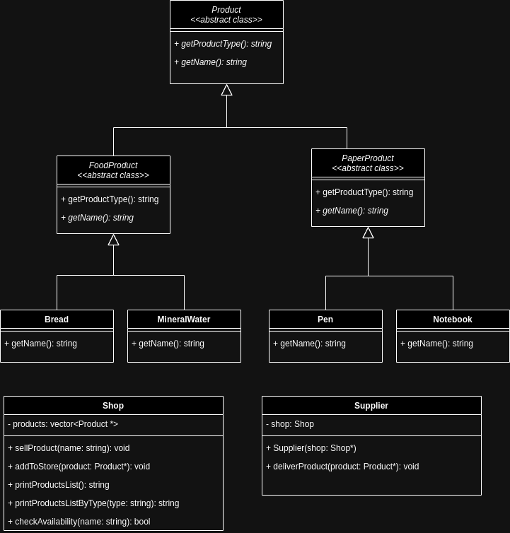

## Zadanie: Implementacja systemu produktów i sklepu

## Cel zadania

Zaimplementuj klasy zgodzie z diagramem klas



i testami jednostkowymi umieszczonymi w:.

- `test_shop.cpp`


## Test

Aby uruchomić testy jednostkowe, wykonaj komendę w termnalu:

```bash
make test_products
make test_shop
```
